# Database Schema — WellPath（九表关系图）

> 事实源：[`src/server/infrastructure/db/schema.ts`](../src/server/infrastructure/db/schema.ts)，首个迁移见 [`drizzle/`](../drizzle)。
> 本图与代码、迁移保持一致；所有时间列 UTC（`timestamptz`），全表具备审计时间列。
> 设计要点：**一切子表以 `assessment_session` 为中心级联；`entitlement`（权益）与测评解耦、可独立续期；访问 Cookie（`access_session`）只证明“本次访问”，绝不保存会员状态，是否付费一律以服务端 `entitlement` 表为准。**

## ER 图（Mermaid，GitHub 原生渲染）

```mermaid
erDiagram
    assessment_session ||--o{ assessment_step : "1:N cascade"
    assessment_session ||--|| assessment_result : "1:1 cascade"
    assessment_session ||--|| entitlement : "1:1 cascade"
    assessment_session ||--o{ subscription : "1:N cascade"
    assessment_session ||--o{ payment_event : "1:N cascade"
    assessment_session ||--o{ recovery_token : "1:N cascade"
    assessment_session ||--o{ access_session : "1:N cascade"

    assessment_session {
        uuid id PK
        text status "in_progress|submitted|deleted"
        timestamptz submitted_at
        timestamptz deleted_at
        timestamptz created_at
        timestamptz updated_at
    }
    assessment_step {
        uuid id PK
        uuid session_id FK
        text step_key "basics|goal|activity|condition"
        jsonb answer "仅业务 payload"
        int revision "乐观锁版本，独立列"
        timestamptz created_at
        timestamptz updated_at
    }
    assessment_result {
        uuid session_id PK,FK
        jsonb payload "会员完整结果(算法版本+输入快照)"
        jsonb free_summary "免费摘要(服务端脱敏依据)"
        timestamptz created_at
    }
    entitlement {
        uuid id PK
        uuid session_id FK,UK "与会话 1:1"
        text tier "free|premium"
        text source
        timestamptz started_at
        timestamptz expires_at "30 天订阅"
    }
    subscription {
        uuid id PK
        uuid session_id FK
        text status "active|expired"
        text product_code
        text external_ref
        timestamptz started_at
        timestamptz expires_at
        timestamptz created_at
    }
    payment_event {
        uuid id PK
        uuid idempotency_key UK "永久唯一，幂等兜底"
        uuid session_id FK
        text event_type
        text status "succeeded|failed"
        jsonb fingerprint "同键异参检测"
        timestamptz created_at
    }
    recovery_token {
        uuid id PK
        uuid session_id FK
        text token_hash UK "仅存 HMAC-SHA256 摘要"
        bool used "单次使用"
        timestamptz expires_at "7 天"
        timestamptz consumed_at
        timestamptz created_at
    }
    access_session {
        uuid id PK
        text token_hash UK "写入 HttpOnly Cookie"
        uuid assessment_session_id FK
        timestamptz expires_at "24h 滑动轮换"
        timestamptz revoked_at
        timestamptz created_at
    }
    rate_counter {
        bigserial id PK
        text scope "create_session|pay"
        text subject "每日轮换 HMAC 指纹(不存原始IP/UA)"
        timestamptz window_start
        int count
    }
```

> `rate_counter` 为跨实例固定窗口限流计数，不与业务表建立外键关系，故未画入主关系簇。

## 三类核心实体的关系（对应题目要求的“用户表 / 数据记录表 / 订阅信息表”）

| 题目概念 | 本表实现 | 说明 |
|---|---|---|
| 用户（匿名） | `assessment_session` + `access_session` | 不做注册体系；创建会话即匿名用户，签发 24h HttpOnly Cookie 标识本次访问 |
| 数据记录 | `assessment_step`（分步）+ `assessment_result`（结果） | 分步增量保存、乐观锁；提交时在单事务内计算并落结果 |
| 订阅信息 | `entitlement`（权益）+ `subscription`（订阅）+ `payment_event`（支付事件） | 权益独立续期，支付事件永久幂等，订阅 30 天 |
| 换设备恢复 | `recovery_token` | 只存 HMAC 摘要、7 天、单次使用 |

## 关键约束

- `assessment_step`：`UNIQUE(session_id, step_key)`，`revision` 乐观锁；条件更新失败返回 409。
- `assessment_result`：`session_id` 主键（1:1），提交与写结果同事务。
- `entitlement`：`session_id UNIQUE`（1:1），重复支付走更新/续期而非新增。
- `payment_event`：`idempotency_key UNIQUE`，数据库唯一约束最终兜底并发双击。
- `recovery_token.token_hash` / `access_session.token_hash`：均只存哈希，不存明文。
- 全部子表对 `assessment_session` `ON DELETE CASCADE`：硬删除会话即清除其草稿/结果/权益痕迹；`rate_counter` 为全局计数不级联。
